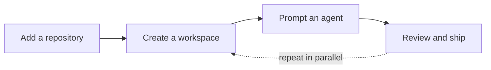

<p align="center">
  
</p>

<h1 align="center">Helmor</h1>

<p align="center">
  The local-first workbench for orchestrating coding agents.
</p>

<p align="center">
  <a href="https://github.com/dohooo/helmor/releases"></a>
  <a href="https://discord.gg/ukyyuNfnDp"></a>
  <a href="https://docs.helmor.ai"></a>
  <a href="./LICENSE"></a>
</p>

<picture>
  <source media="(prefers-color-scheme: dark)" srcset="src/assets/helmor-screenshot-dark.png" />
  
</picture>

> AI made coding faster.
>
> Helmor is about finishing the rest of the loop —
> orchestrating, reviewing, testing, merging, and actually shipping software.

Helmor runs many coding agents in parallel, each in its own isolated git
workspace — conversation, diffs, editor, terminals, and one-click PR actions
in one window. Everything lives locally under `~/helmor/`.

## Features

- **Isolated workspaces** — one git worktree and branch per task; agents never step on each other.
- **Bring your own agents** — Claude Code, Codex, Cursor, OpenCode, and Kimi Code; your logins, API keys, and custom providers.
- **Review without leaving** — diffs, Monaco editor, and terminals beside the conversation.
- **Ship from one button** — create PR/MR, merge, fix CI, resolve conflicts, stacked PRs; GitHub and GitLab.
- **Terminal Mode** — run prompts in the agent's native TUI, or resume a GUI chat in the terminal.
- **Quick panel** — ⇧⌥Space opens a floating window to start a workspace and chat from anywhere.
- **Scriptable** — `helmor` CLI and MCP server; your terminal or another agent can drive Helmor.
- **Skills** — install from onboarding or **Settings → Helmor Components**; browse with `/` in the composer.
- **Mobile companion** *(experimental)* — Cloudflare tunnel to your desktop; start tasks from your phone's browser.

*More on the way — Slack & GitHub context, plan mode, and agent-driven orchestration.*

## How it works



1. **Add a repository** — link a local clone, or clone from a URL.
2. **Create a workspace** — fresh git worktree and branch under `~/helmor/workspaces/`.
3. **Prompt an agent** — describe the task and move on while it runs.
4. **Review and ship** — read the diff, run tests, create and merge the PR.

## Get started

[**Download Helmor →**](https://github.com/dohooo/helmor/releases)

macOS (Apple Silicon & Intel) · Windows (x64)

[**Read the docs →**](https://docs.helmor.ai)

On first launch, connect GitHub or GitLab and sign in to your first agent. Agent
CLIs are bundled — nothing else to install.

## CLI

Install from **Settings → Experimental → Command Line Tool**. Works against the
same local database as the app — even while it is running.

```bash
helmor repo add /path/to/repo
helmor workspace new --repo myapp
helmor workspace list
helmor send --workspace myapp/feature-x "Add a test for the parser edge case."
helmor workspace status myapp/feature-x
helmor workspace run-action myapp/feature-x   # create PR, merge, fix CI, …
helmor mcp                                    # MCP server over stdio
```

Workspaces use `repo-name/directory-name` shorthand. Every command supports
`--json`. Run `helmor --help` for the full reference.

**Example — an agent ships a fix:**

```bash
helmor workspace new --repo myapp --name fix-auth
helmor send --workspace myapp/fix-auth "Add tests for the token refresh path."
helmor workspace status myapp/fix-auth
helmor workspace run-action myapp/fix-auth
```

## Contributing

Architecture, commands, and test layout live in **[AGENTS.md](AGENTS.md)**.
To get started locally: `bun install && bun run dev`.

Or —

Open Helmor, Import Helmor, Ask Helmor:

> _"How do I contribute to Helmor?"_

That's the guide.

## Community

- [Discord](https://discord.gg/ukyyuNfnDp) — questions, feedback, release chat
- [GitHub Issues](https://github.com/dohooo/helmor/issues) — bugs and feature requests
- Or use the feedback button at the bottom of Helmor's sidebar

## License

[Apache 2.0](./LICENSE)
